# Cisco ACI - Integration and Deployment with SUSE OpenStack Cloud 7


## Introduction and Scope
This document provides a detailed description of concepts and steps involved with integration of Cisco ACI as a backend SDN solution with SUSE OpenStack Cloud 7. This document does not cover details describing the deployment and administration of SUSE OpenStack Cloud 7 itself which can be obtained from the standard documentation from SOC7. This document also does not provide an in-depth documentation and recommendations for Cisco ACI fabric configuration. The document tries to describe the steps to move from the default OpenvSwitch-based deployment of SOC7 to using Cisco ACI as the ML2 backend. More information regarding specific ACI configurations and best practices can be found in the relevant [APIC](https://www.cisco.com/c/en/us/support/cloud-systems-management/application-policy-infrastructure-controller-apic/tsd-products-support-series-home.html) documents.


## Prerequisites
* At least 2 leafs on a Leaf-And-Spine ACI fabric using Cisco Nexus 9000 switches with support for APIC.
* Integration to be based on ACI Firmware version 2.2(3) and SUSE OpenStack Cloud 7 (Openstack Newton-based)
* A dedicated host for APIC controller with the required licenses to manage the ACI fabric.
* Servers connected as leaf nodes to the ACI fabric and accessible from the APIC host and allocated as Controller and Compute nodes.
* A dedicated node that can be used as Admin node to deploy and configure SUSE OpenStack Cloud (Crowbar installation).


## SUSE OpenStack Cloud 7 Networking requirements
SOC 7 uses the network architecture as shown in the figure below as the default configuration.

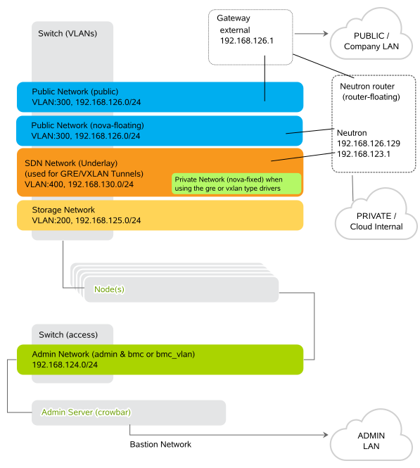

The network design can be changed before starting the SOC Crowbar installation on the admin server.

More details regarding modifying the network configuration for the cloud can be found [here](https://www.suse.com/documentation/suse-openstack-cloud-7/book_cloud_deploy/data/sec_depl_adm_inst_crowbar_network.html)

Details about different network modes and creating a bastion network for external access to admin server can be found [here](https://www.suse.com/documentation/suse-openstack-cloud-7/book_cloud_deploy/data/sec_depl_adm_inst_crowbar_mode.html).

Once the network settings are updated and crowbar is installed, it wont be possible to change them unless the admin server is re-installed again. Also, these settings should be ideally done before installing and configuring the controller and compute nodes.

The initial network settings for ACI deployment in the test solution (described below in section 4) is not different from the default settings. 


## SOC 7 Lab setup or the Test Solution
This section briefly describes the development lab setup used for integration with ACI and here-after will be referred to as the "Test Solution."

All the information provided in this document is based on the configuration done for the test solution implemented in the Cisco ACI lab accessible by SUSE for development and POC purposes. The actual production deployments could follow different architecture and scale. The network architecture of the test lab is as shown in the figure below.

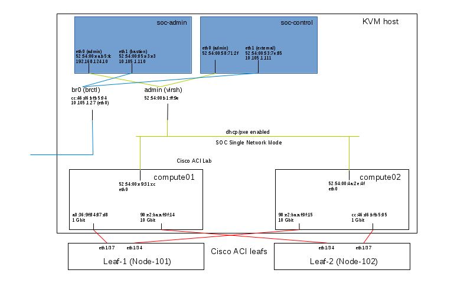


## Cisco ACI Configuration
The following figure shows a typical deployment topology of SUSE OpenStack Cloud with Cisco ACI. 

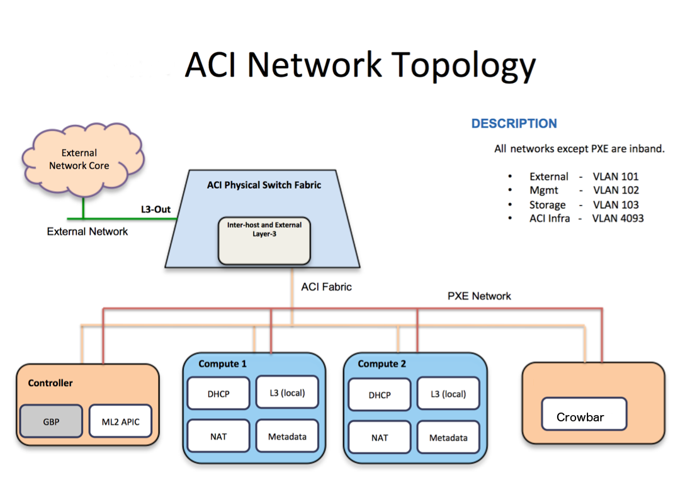

* PXE network is Out-Of-Band and uses a dedicated interface
* All other Crowbar networks (External, Management and Storage) are In-band through ACI
* L3-Out is pre-configured (in this example, it is called L3-Out and EPG is L3-Out-EPG)

#### Note: To prepare ACI for in-band configuration, we can use Physical Domain and static binding to EPGs created for these networks.


Deployment of SUSE OpenStack Cloud 7 with Cisco ACI requires several configuration actions to be taken in advance on the ACI fabric. All configuration can be done through the universal APIC GUI. The typical steps to configure the ACI fabric are listed here.

For more details on working with the APIC, refer to the documentation on [Operating Application Centric Infrastructure](https://www.cisco.com/c/en/us/td/docs/switches/datacenter/aci/apic/sw/1-x/Operating_ACI/guide/b_Cisco_Operating_ACI.html).


### VLAN Pool:
VLAN Pools define a range of VLAN IDs that will be used by the EPG. Using the GUI, the VLAN pool can be created at Fabric -> Access Policies -> Pools -> VLAN (Actions-> Create VLAN Pool).

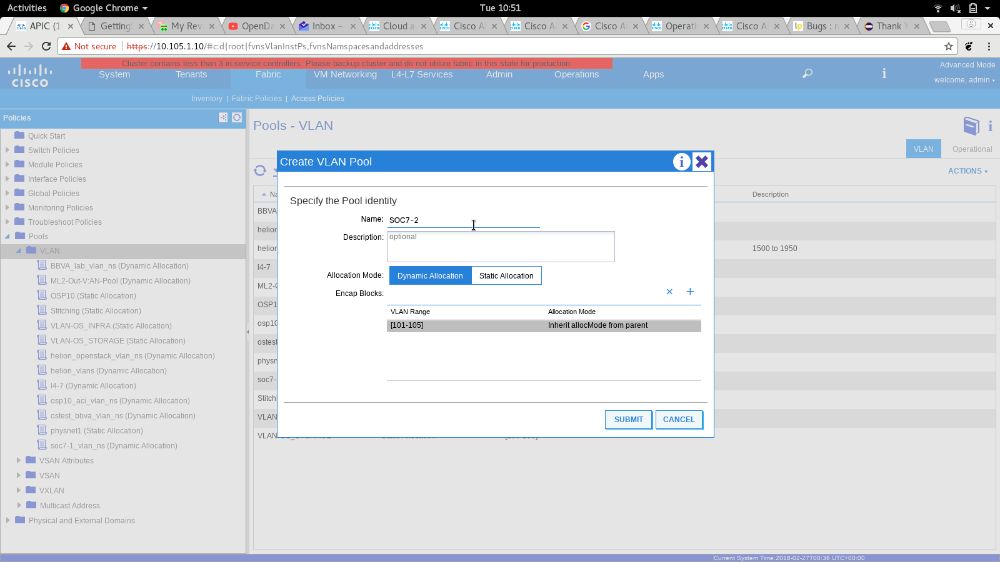


### Physical Domain:
Create a Physical Domain and assign the above VLAN Pool to it.

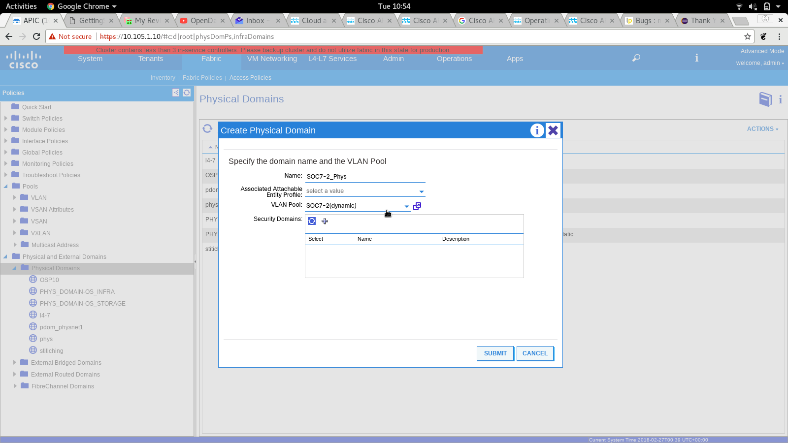


### Attachable Entity Profile
Create an AEP and assign the Physical Domain.

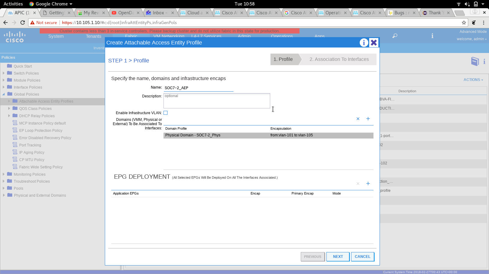


### VRF:
Create a VRF (Virtual Routing and Forwarding).

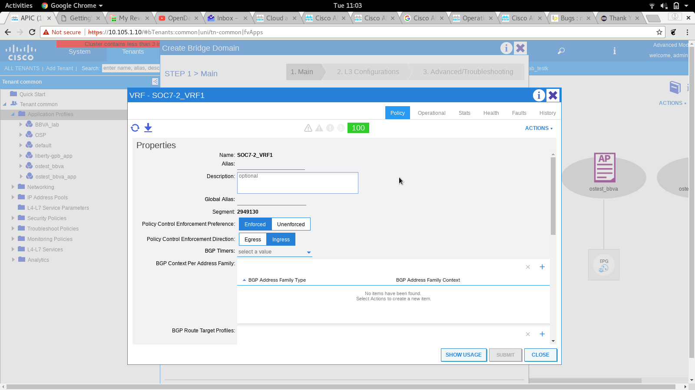


### Bridge Domain:
Create Bridge Domains.

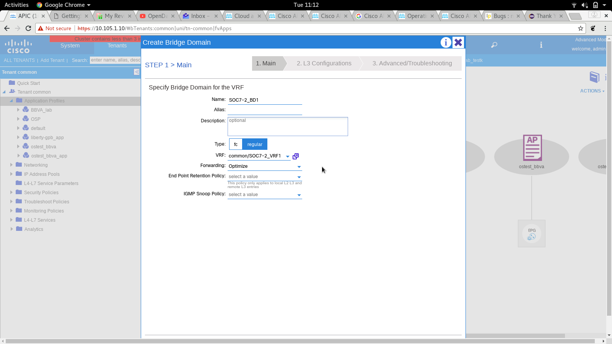


### Application Profile:
Create the Application profile for deployment (SOC7-2 in the example below).

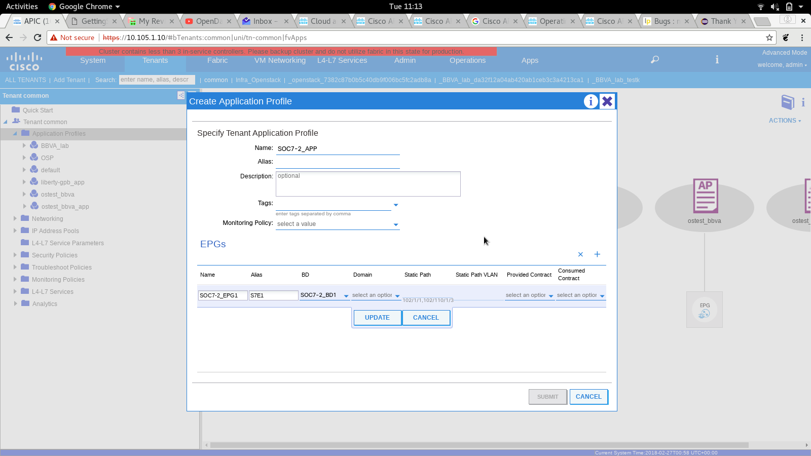


### EPG:
Deploy Static EPGs (Endpoint Groups) as required.

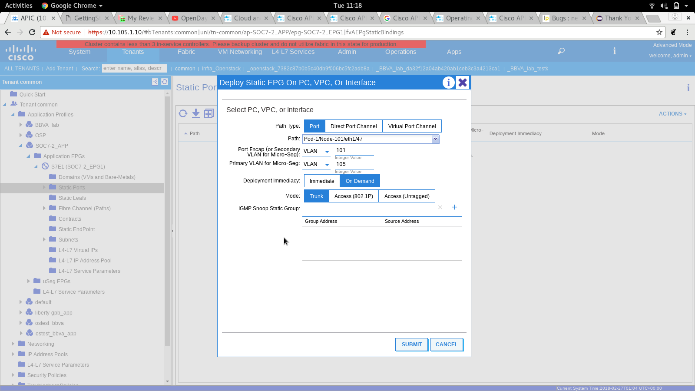


### Physical Domain Association
* Associate the Physical Domain created above with the Application Profile.

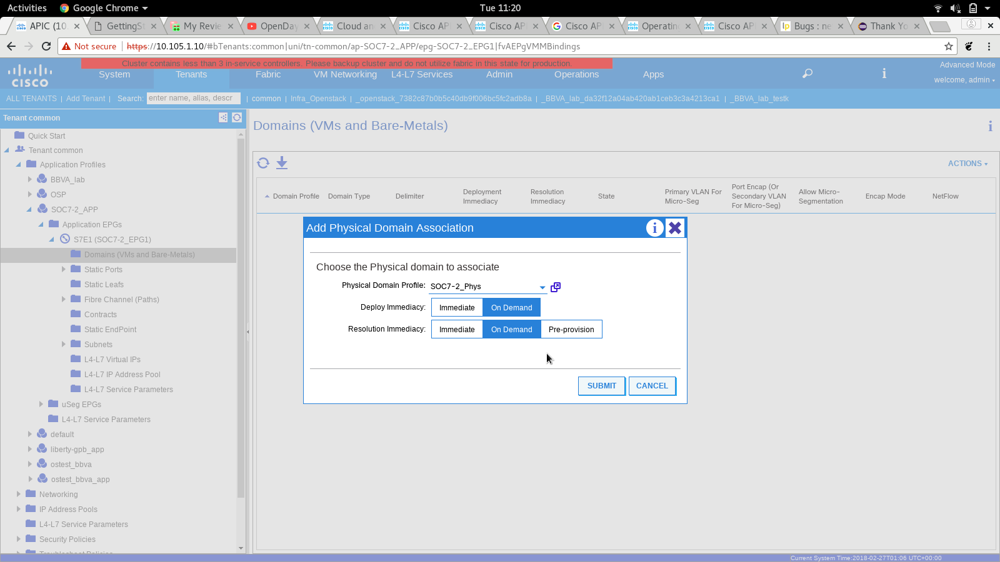

* Verify the physical domains are associated to all the EPGs

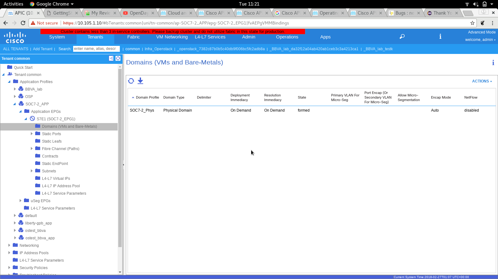

* Now the system would be ready for SOC 7 deployment (explained in the later sections).

* Upon completion, ensure that the openstack VMM domain is created and associated ("soc7-2" in the example shown below).

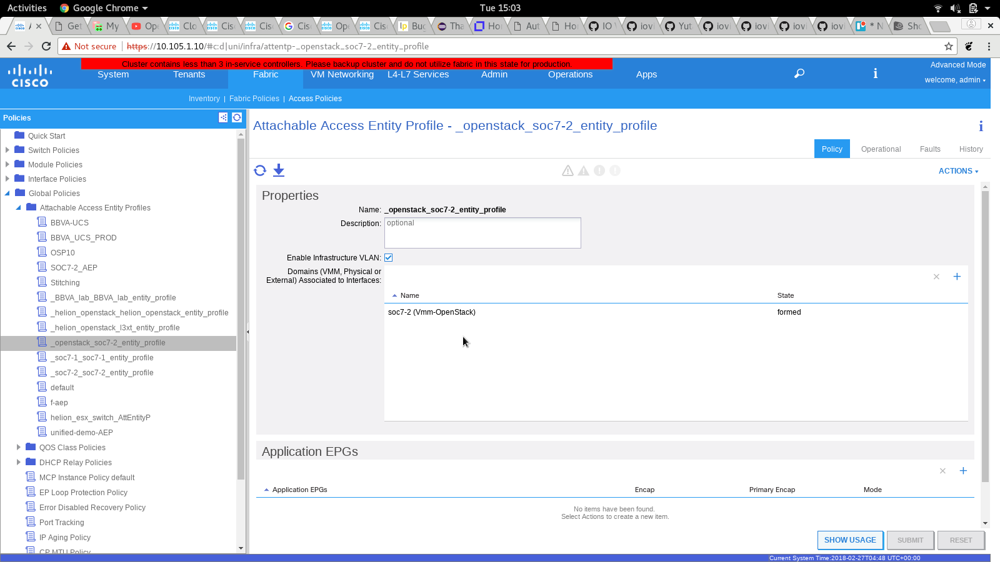

* For SOC7, the application profile associated with the VMM domain is named based on the entry of "apic_system_id" in /etc/neutron/plugins/ml2/ml2_conf_cisco_apic.ini

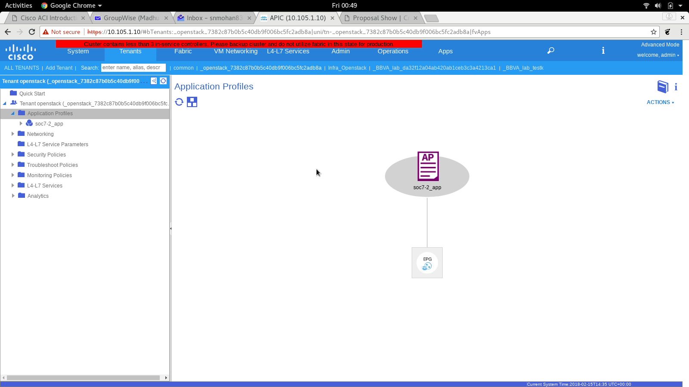

* ACI Tenant - VMM Domain with SOC 7

The test solution with SOC 7 uses the default mode with single_tenant_mode = true. This allows for a single ACI tenant for all openstack tenants which also maps to a single VMM domain. There can be other VMM domains in the ACI tenant along with the openstack tenant. Additional openstack tenants can be identified as separate Application Profiles within the same ACI tenant. The image below shows the list of tenants used in the test solution lab.

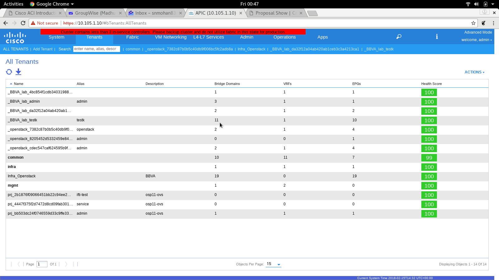

Note: It is possible to change the mode to use a single ACI tenant for each openstack tenant by setting  single_tenant_mode = false. However, this mode is not yet tested with SOC 7 and hence crowbar does not support altering this parameter as of the current implementation. This can be implemented as a change request for SOC 7 but requires suitable lab setup to test the option thoroughly.

* Endpoint Group and Bridge domains with SOC 7

The End Point Group (EPG) along with the Bridge Domain (BD) together represent a Tenant network for Openstack. The EPGs and Contracts can be created as required by the access specifications of the application and needs to be associated with the Openstack VMM domain. An example from the test solution is shown below: 

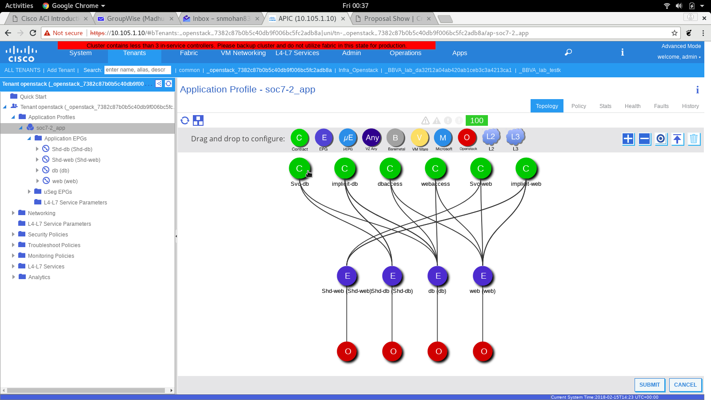

### External Routed Networks with SOC 7 ACI integration

The test solution uses the default L3 Out using the ACI’s internal fabric VRFs linked to the physical interface. The setting in /etc/neutron/neutron.conf for service_plugins lists apic_gbp_l3 (for GBP mode) or cisco_apic_l3 (for ML2 mode) uses the default L3 Out mechanism. The physical interface linked to the ML2 L3 out in the test solution can be seen in the below image:

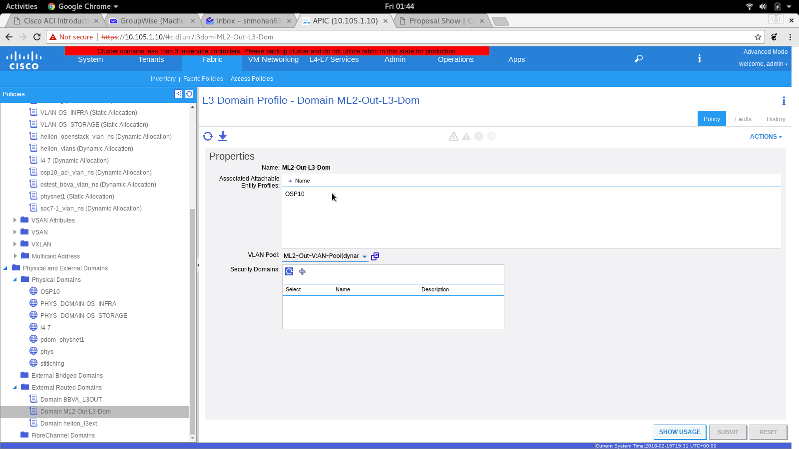

#### Setup a Route Reflector

We need to have a BGP route reflector policy to allow that static route for the L3out to be advertised to other no border leaf nodes in the fabric. The BGP route-reflector policy is used for advertising dynamic routes and static routes to the non-border leaves in the fabric. If you are using any kind of L3out the best practice is to configure the  RR policy using below command on the controller:

```
apic route-reflector-create --apic-ip <APIC IP> --apic-username admin --apic-password <password> --no-secure
```

#### Configure External Connectivity

Please make sure you have pre-existing L3 out (for example Datacenter-Out) and pre-existing external EPG (say Datacenter-Out-Epg) for it, then on controllers ensure that the plugin configuration includes this info:

```
 [apic_external_network:Datacenter-Out]
 preexisting=True
 external_epg=Datacenter-Out-Epg
 host_pool_cidr = 2.101.2.1/24
```

In above example Datacenter-Out is name of l3-out on ACI and Datacenter-Out-Epg is the name of EPG. The SNAT pool is secified by `host_pool_cidr`.


## Admin Node Preparation
The SUSE OpenStack cloud Admin node should be prepared before starting out with crowbar and ACI integration. The packages required for ACI integration are not currently part of the SUSE OpenStack Cloud 7 media. These packages have to be explicitly downloaded into the admin node.

The rpms are available at: 
1. https://download.opensuse.org/repositories/Cloud:/OpenStack:/Newton:/cisco-apic/SLE_12_SP3/noarch/
and
2. https://download.opensuse.org/repositories/Cloud:/OpenStack:/Newton:/cisco-apic/SLE_12_SP3/x86_64/

Download the rpms from both the urls to corresponding folders in /srv/tftpboot/suse-12.2/x86_64/repos/PTF/rpm/ and update the repo by executing createrepo-cloud-ptf on the prompt.

Run zypper refresh on the nodes to update the newly created rpms and make them accessible on the nodes.

## Switch Configurations on the Control and Compute nodes
The traffic between ACI fabric to the nodes are channeled through VXLAN tunnel attached to the integration bridge. This setup connects the ACI leaf nodes with the compute and controller hosts which are virtual machines in case of the lab solution. Run these commands on the nodes to get the required OVS configurations on the compute and controller nodes as soon as the nodes are up and running. Configuring the Opflex section of the Crowbar (shown in the later section) to use the bridge port created here allows the ACI to recognize the leaf nodes. 

``` bash
    sudo systemctl start openvswitch

    sudo systemctl enable openvswitch

    sudo ovs-vsctl add-br br-int

    sudo ovs-vsctl set bridge br-int protocols=[]

    sudo ovs-vsctl add-port br-int br-int_vxlan0 type=vxlan options:remote_ip=flow -- set Interface br-int_vxlan0 options:key=flow options:dst_port=8472
```

    The test lab OVS looks like below after the above configuration.

* Controller Node:

```
    root@d52-54-00-02-02-01:~ # sudo ovs-vsctl show 
    0c91a644-7a96-498f-afb6-210f2f299b09
     Manager "ptcp:6640:127.0.0.1"
     is_connected: true
       Bridge br-public
         Port br-public
           Interface br-public
           type: internal
       Bridge br-tunnel
         Controller "tcp:127.0.0.1:6633"
         is_connected: true
         fail_mode: secure
         Port patch-int
           Interface patch-int
           type: patch
           options: {peer=patch-tun}
         Port br-tunnel
           Interface br-tunnel
           type: internal
       Bridge br-int
         Controller "tcp:127.0.0.1:6633"
         is_connected: true
         fail_mode: secure
         Port "br-int_vxlan0" 
           Interface "br-int_vxlan0"
           type: vxlan
           options: {dst_port="8472", key=flow, remote_ip=flow}
         Port br-int
           Interface br-int
           type: internal
         Port int-br-public
           Interface int-br-public
           type: patch
           options: {peer=phy-br-public}
         Port patch-tun
            Interface patch-tun
            type: patch
            options: {peer=patch-int}
    ovs_version: "2.6.0"
```

* Compute Node:

```
    root@d52-54-00-02-03-02:~ # ovs-vsctl show
    e7671cf6-58ff-4078-8498-930a19e0bf56
      Bridge br-int
        fail_mode: secure
        Port "br-int_vxlan0"
          Interface "br-int_vxlan0"
          type: vxlan
          options: {dst_port="8472", key=flow, remote_ip=flow}
        Port of-svc-ovsport
          Interface of-svc-ovsport
        Port br-int
          Interface br-int
          type: internal
    ovs_version: "2.6.0"
```

## Compute Node YaST Configurations
A few manual steps are necessary to be configured on the compute nodes before deploying the neutron barclamp.  These steps should be done on the compute node with SSH access to the node.

1. Start Yast on the compute node and select System→ Network Settings as below.

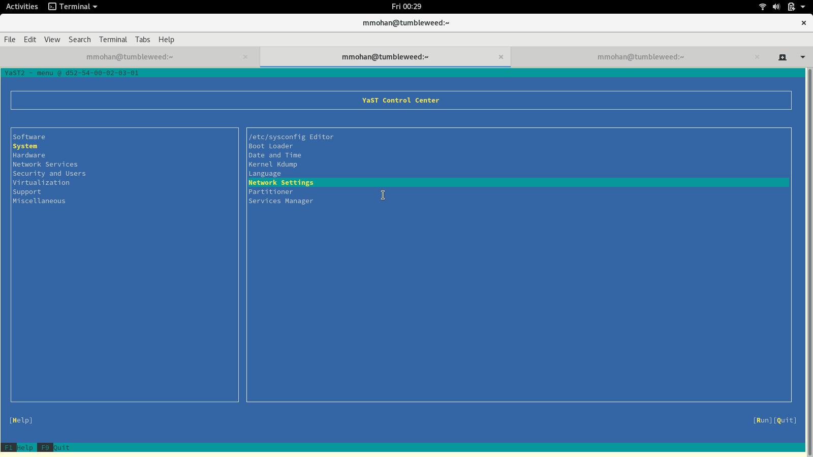

2. Select “Continue” when prompted with the warning below.

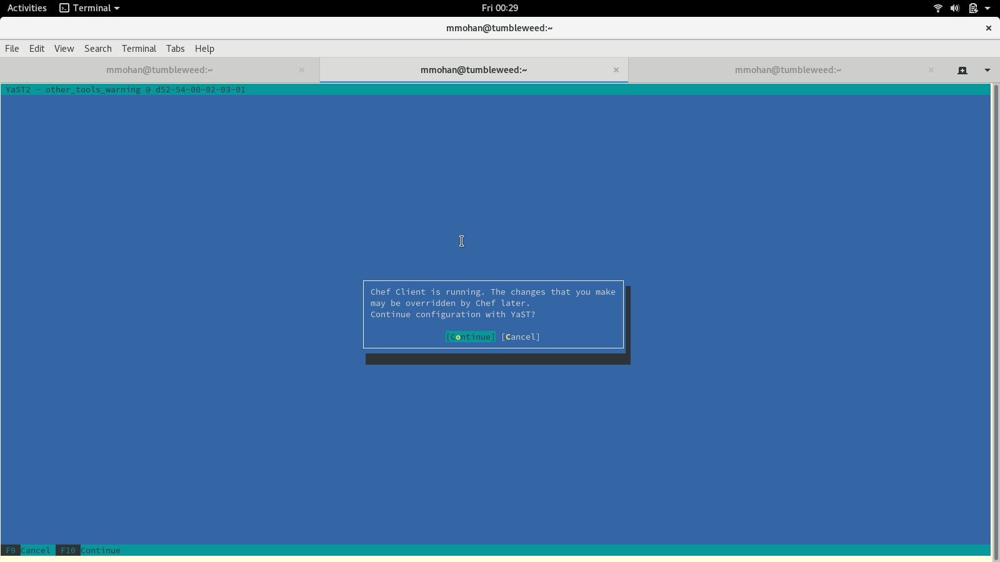

3. Select the interface connected to the ACI to Edit

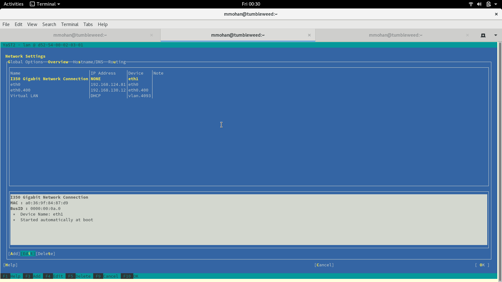

4. Select the option “No Link and IP Setup” 

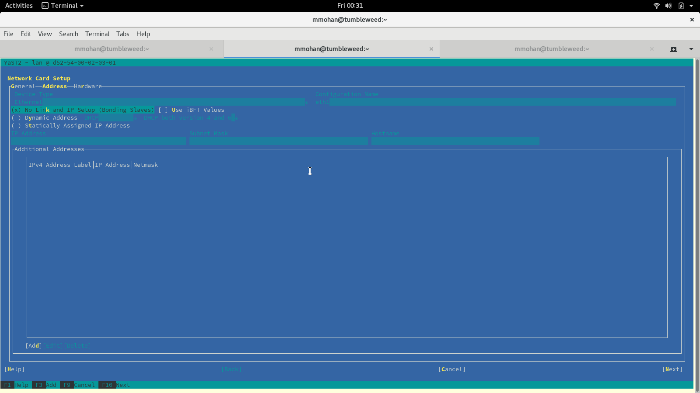

5. In the “General” tab, set the Device Activation setting to “At Boot Time” and MTU to 1600 and click on Next to continue.

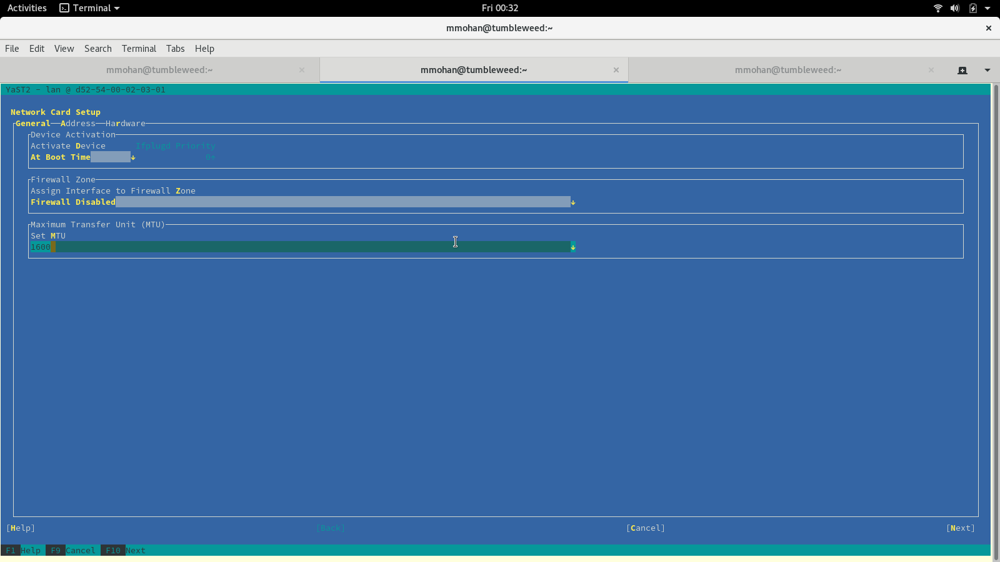

6. Add a new interface to create a VLAN attached to the ACI interface with the VLAN ID as obtained from the ACI fabric. The example below uses 4093 which is commonly the default VLAN ID for ACI deployments.

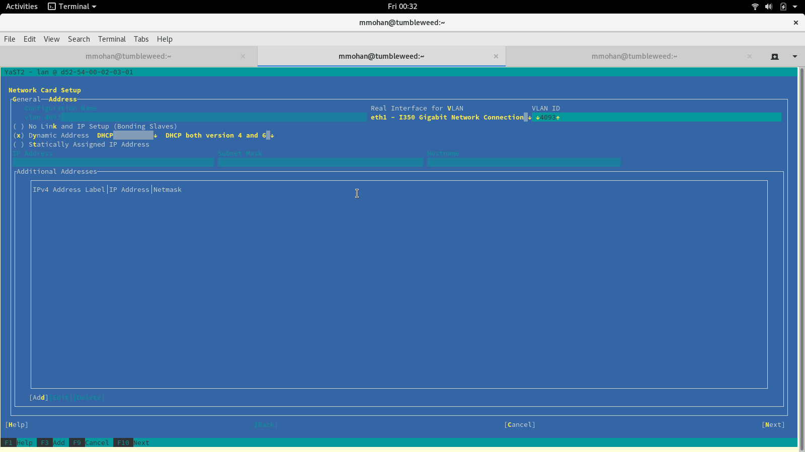

7. Setup DNS server details and suitable domain name and host names.

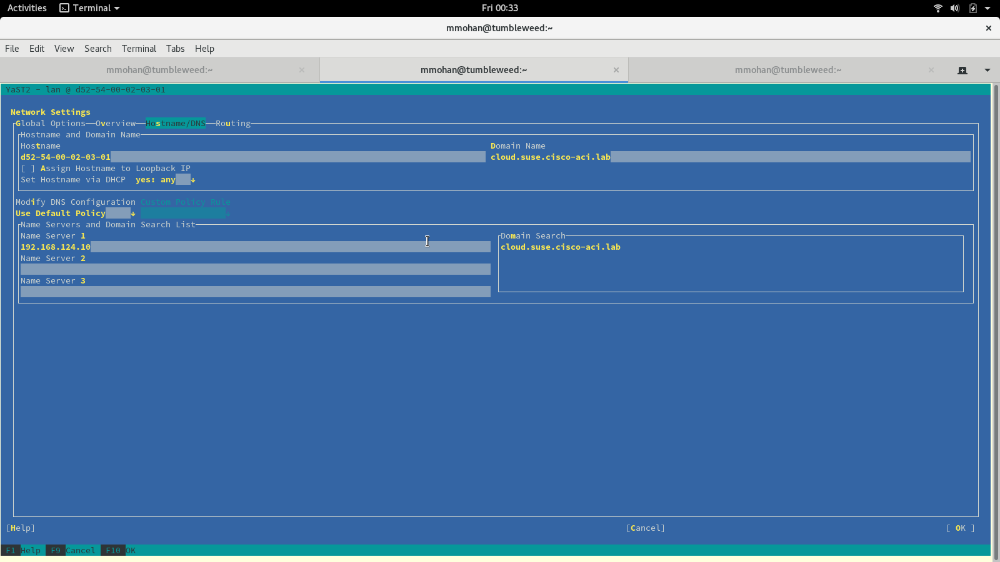

8. Add additional routing and click on “OK” to save the changes and “Quit” to get back to the command prompt.

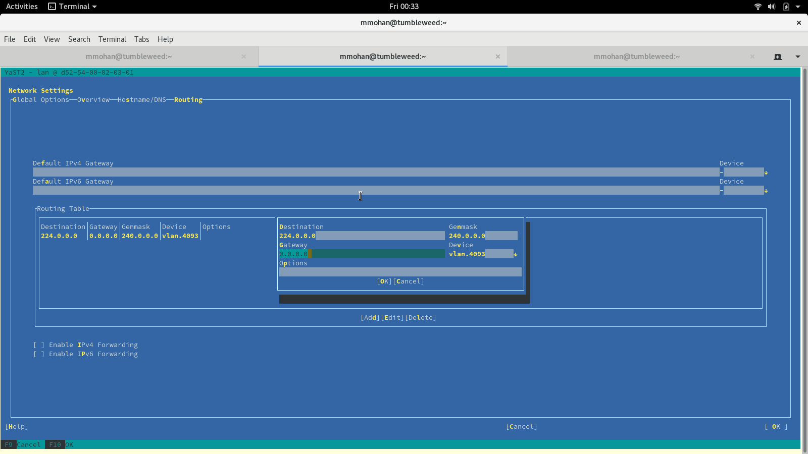


## Crowbar Proposal Template

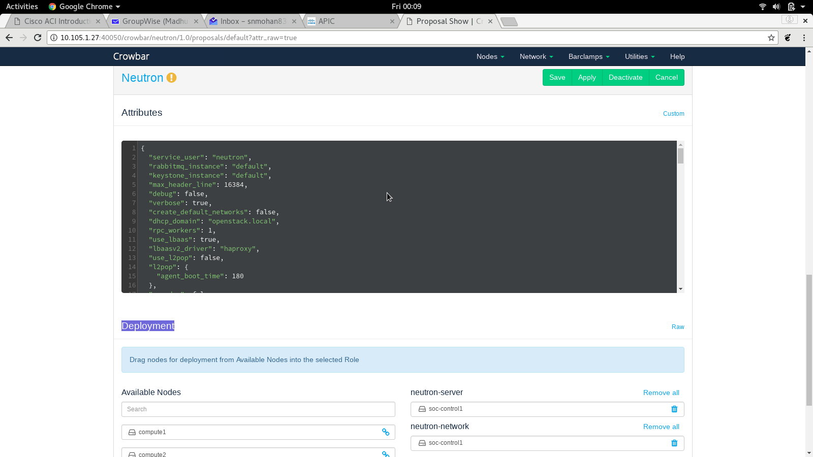

Select the neutron barclamp in the barclamp list in the Crowbar UI and edit the proposal in the Raw mode with the data as shown below. Note the parameters like the “host”, “peer_ip”, “remote_ip”, “username” and “password” and update them accordingly. The ACI related parameters are shown here in bold.

```
{
    "service_user": "neutron",
    "rabbitmq_instance": "default",
    "keystone_instance": "default",
    "max_header_line": 16384,
    "debug": false,
    "verbose": true,
    "create_default_networks": false,
    "dhcp_domain": "openstack.local",
    "rpc_workers": 1,
    "use_lbaas": true,
    "lbaasv2_driver": "haproxy",
    "use_l2pop": false,
    "l2pop": {
        "agent_boot_time": 180
    },
    "use_dvr": false,
    "additional_external_networks": [

        ],
    "networking_plugin": "ml2",
    "ml2_mechanism_drivers": [
        "cisco_apic_ml2"
        ],
    "ml2_type_drivers": [
        "opflex",
    “vxlan”,
    “vlan”
        ],
    "ml2_type_drivers_default_provider_network": "opflex",
    "ml2_type_drivers_default_tenant_network": "opflex",
    "num_vlans": 2000,
    "gre": {
        "tunnel_id_start": 1,
        "tunnel_id_end": 1000
    },
    "vxlan": {
        "vni_start": 4096,
        "vni_end": 99999,
        "multicast_group": "239.1.1.1"
    },
    "ovs": {
        "tunnel_csum": false,
        "of_interface": "native",
        "ovsdb_interface": "native"
    },
    "apic": {
        "hosts": "soc7-2",
        "system_id": "soc",
        "username": "admin",
        "password": "",
        // The information in the below section is specific to a single   
        // ACI fabric or POD and one needs to refer to the ACI Infra 
        // default values for the specific fabric with the exception of
        // the encap_iface which is the name of the port attached to br-int 
        // for vxlan tunneling described in the previous section. 
        "opflex": {
            "peer_ip": "10.0.0.30", // ACI-INFRA BD subnet IP and port
            "peer_port": 8009,
            "encap": "vxlan",       
            "vxlan": {  
                "encap_iface": "br-int_vxlan0", 
                "uplink_iface": "vlan.4093", // interface on the computes
                "uplink_vlan": 4093,     // default APIC Infra VLAN ID
                "remote_ip": "10.0.0.32", // default FTEP IP and port
                "remote_port": 8472
            },
            "vlan": {
                "encap_iface": ""
            }
        },
        // Refer to the lines after this template for the method used to get 
        // information about the switch ports from the compute nodes.
        "apic_switches": {
            "101": {
                "switch_ports": {
                    "52-54-00-02-03-02": {
                        "switch_port": "1/38"
                    }
                }
            },
            "102": {
                "switch_ports": {
                    "52-54-00-02-03-01": {
                        "switch_port": "1/38"
                    }
                }
            }
        }
    },
    "allow_overlapping_ips": true,
    "use_syslog": false,
    "database_instance": "default",
    "db": {
        "database": "neutron",
        "user": "neutron",
        "password": "FswNOLZqylNN"
    },
    "sql": {
        "min_pool_size": 30,
        "max_pool_size": 60,
        "max_pool_overflow": 10,
        "pool_timeout": 30
    },
    "f5": {
        "ha_type":
            "standalone",
        "icontrol_hostname":
            "",
        "icontrol_username":
            "admin",
        "icontrol_password":
            "",
        "parent_ssl_profile":
            "clientssl",
        "external_physical_mappings":
            "default:1.1:True",
        "vtep_folder":
            "Common",
        "vtep_selfip_name":
            "vtep",
        "max_namespaces_per_tenant":
            1,
        "route_domain_strictness":
            false
    },
    "vmware":
    {
        "user":
            "",
        "password":
            "",
        "port":
            "443",
        "controllers":
            "",
        "tz_uuid":
            "",
        "l3_gw_uuid":
            ""
    },
    "vmware_dvs":
    {
        "clean_on_restart":
            true,
        "precreate_networks":
            false
    },
    "zvm":
    {
        "zvm_xcat_server":
            "",
        "zvm_xcat_username":
            "",
        "zvm_xcat_password":
            "",
        "zvm_physnet_rdev":
            "",
        "zvm_xcat_zhcp_nodename":
            "zhcp",
        "xcat_mgt_ip":
            "10.1.0.1",
        "xcat_mgt_mask":
            "255.255.0.0",
        "zvm_xcat_mgt_vswitch":
            "xcatvsw2"
    },
    "ssl":
    {
        "certfile":
            "/etc/neutron/ssl/certs/signing_cert.pem",
        "keyfile":
            "/etc/neutron/ssl/private/signing_key.pem",
        "generate_certs":
            false,
        "insecure":
            false,
        "cert_required":
            false,
        "ca_certs":
            "/etc/neutron/ssl/certs/ca.pem"
    },
    "api":
    {
        "protocol":
            "http",
        "service_port":
            9696,
        "service_host":
            "0.0.0.0"
    },
    "use_infoblox":
        false,
    "infoblox":
    {
        "cloud_data_center_id":
            1,
        "ipam_agent_workers":
            1,
        "grids":
            [
            {
                "admin_user_name":
                    "admin",
                "admin_password":
                    "password",
                "grid_master_host":
                    "gridmaster1.example.net",
                "grid_master_name":
                    "gridmaster1",
                "data_center_name":
                    "dc1"
            }
        ],
            "grid_defaults":
            {
                "http_pool_connections":
                    100,
                "http_pool_maxsize":
                    100,
                "http_request_timeout":
                    120,
                "ssl_verify":
                    false,
                "wapi_version":
                    "2.2.2",
                "wapi_max_results":
                    -1000
            }
    },
    "ha_rate_limit":
    {
        "neutron-server":
            0
    },
    "service_password":
        "IoFwO8pV4Y5C"
}
```

The entries for each switch must be obtained by running “lldpctl” on the respective compute nodes and copying the value in the PortDescr field as shown in the image below.

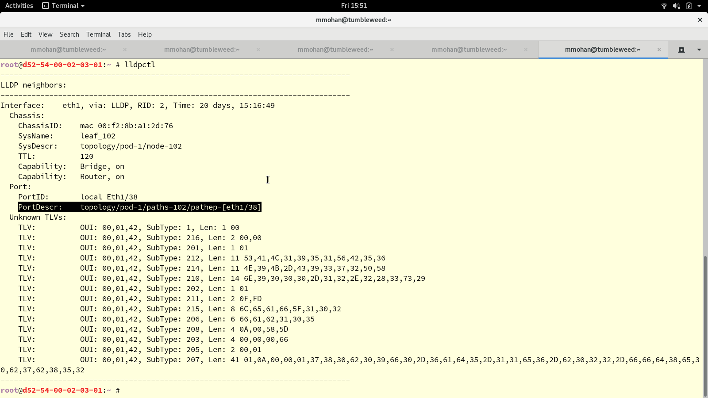

Click on the Apply button to apply the neutron proposal and verify the ACI artifacts as specified in section 5.


## Current Status of SOC7 ACI Integration
SOC 7 can be currently used with ML2 and GBP mode with ACI and configured accordingly by setting the suitable driver for “ml2_mechanism_drivers” (“cisco_apic_ml2” and “apic_gbp”).  Please check with us for the right PTF to enable these modes.  

ML2 and GBP modes have been tested with SOC 7 on the Test lab described in section 4. 
